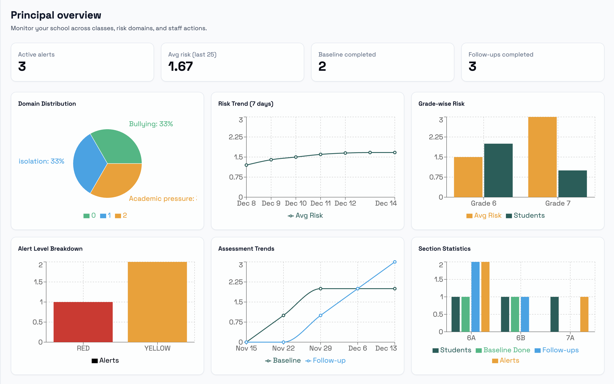
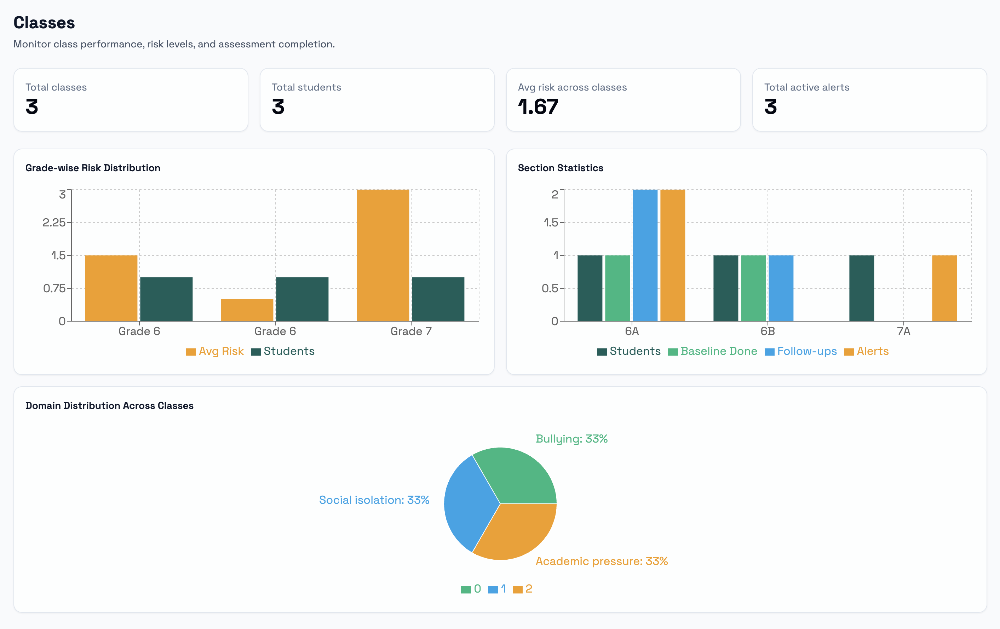
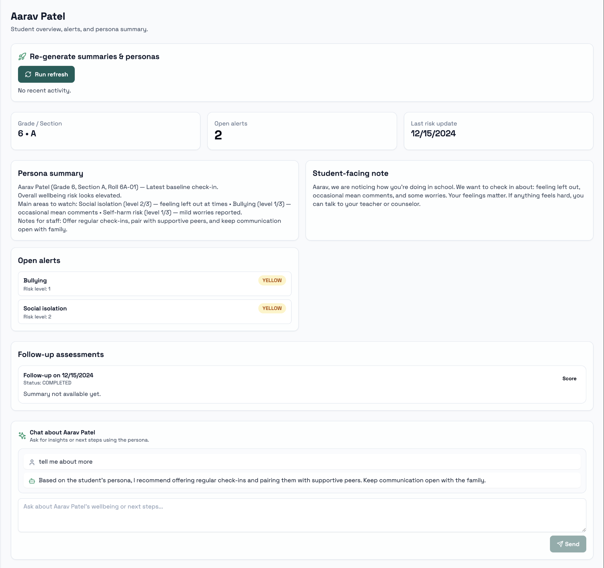
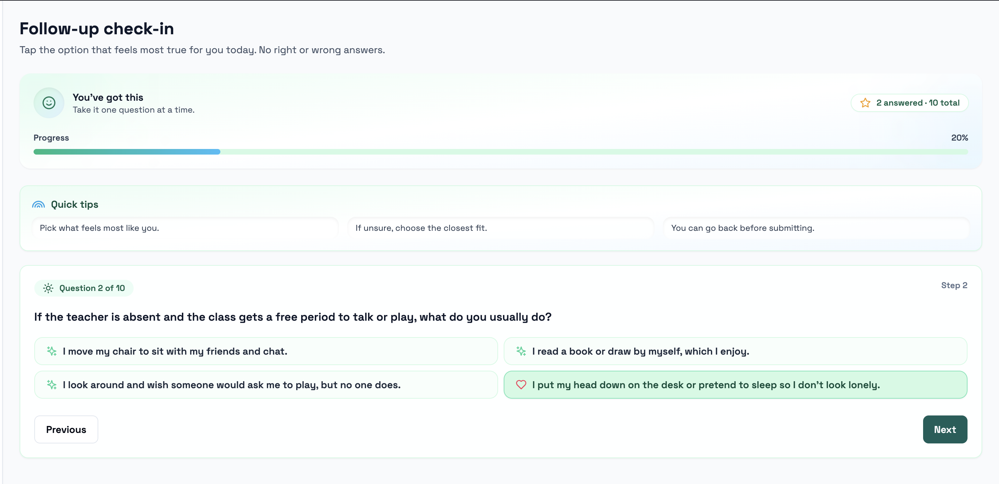

# MITR – Intelligent Student Well-Being & Assessment Portal

**Machine for Interpersonal Thoughts Response**

*A Next.js + MCP + RAG + OpenAI powered early-intervention system for schools*

---

## Table of Contents

1. [Vision](#1-vision)
2. [Core Domains of Assessment](#2-core-domains-of-assessment)
3. [User Roles & Permissions](#3-user-roles--permissions)
4. [Assessment Flow & Logic](#4-assessment-flow--logic)
5. [Core Features](#5-core-features)
6. [Technical Architecture](#6-technical-architecture)
7. [System Architecture](#7-system-architecture)
8. [Data Flow](#8-data-flow)
9. [User Journeys](#9-user-journeys)
10. [Safety & Ethics](#10-safety--ethics)
11. [Getting Started](#11-getting-started)
12. [Screenshots](#12-screenshots)

---

## 1. Vision

MITR is an AI-powered student well-being assessment platform designed to proactively detect signs of emotional, social, and academic distress in school students.

It provides **safe, neutral, non-diagnostic assessments**, converts results into **actionable insights** for teachers and principals, and supports **human-in-the-loop decision-making** through intelligent AI conversations.

### Goals

👉 Identify student struggles **early**  
👉 Reduce unnoticed suffering  
👉 Empower teachers and counselors  
👉 Keep students safe, understood, and supported


---

## 2. Core Domains of Assessment

MITR specializes in eight risk domains:

1. **Bullying**
2. **Self-harm risk**
3. **Family stress**
4. **Academic pressure**
5. **Social isolation**
6. **Trauma**
7. **Neglect**
8. **Eating disorders**

All tests, patterns, insights, and alerts are based on these domains.

---

## 3. User Roles & Permissions

### 3.1 Student

- View basic profile
- Take baseline & follow-up MCQ tests
- No visibility into domains, scores, flags, or risk labels

### 3.2 Teacher

- See class dashboard
- View domain-level results & explanations
- Upload notes, observations, or student work (images, assignments, PDFs)
- Chat with AI to interpret results and get guidance
- Mark tests as **False Alert**
- Receive high-risk alerts via email

### 3.3 Principal

- See school-wide insights
- Monitor all student alerts
- View class-level analytics
- Manage staff and classes
- Receive all high-risk alert emails
- Configure notification & threshold policies

### 3.4 Parent

- View child's profile
- See teacher observations and general well-being notes
- No access to domain breakdown or sensitive test details

### 3.5 Master Admin

- Create and manage schools
- Add principal accounts
- Configure global settings

---

## 4. Assessment Flow & Logic

### 4.1 Phase 1 — Baseline Assessment (25 Questions)

**Purpose:** Build a complete initial understanding of each student across all 8 domains.

**Characteristics:**
- 25 questions
- 2–3 questions per domain
- Neutral tone (no mental health wording)
- Mostly 1–5 Likert scale
- 1–2 **personal interest questions** to build connection (e.g., "What do you like in nature?")

This creates the **student's first risk profile**.

### 4.2 Phase 2 — RAG-Driven Adaptive Follow-Up Assessments

After baseline:
- Each student gets **10–15 question adaptive assessments**
- Focus on **domains where earlier tests showed concerns**
- Pulls context from:
  - Previous tests
  - Teacher notes
  - Student uploads (summarized)
  - Preferences
- Generates:
  - Domain-specific questions
  - 1–2 personalized engagement questions (e.g., "Last time you liked trees…")

LLM + RAG ensures personalization while staying safe and non-invasive.

### 4.3 Domain Scoring

Every test produces a **risk level** per domain:

- **0** — No concern
- **1** — Mild concern (monitor)
- **2** — Moderate concern (teacher action recommended)
- **3** — High concern (serious attention needed)

Follow-up logic uses these scores to:
- Trigger alerts
- Decide next test focus
- Update student's risk trajectory

---

## 5. Core Features

### 5.1 Teacher–AI Interactive Insight Chat

Teachers can open a flagged test and ask:
- "Why was bullying flagged?"
- "Did something similar happen earlier?"
- "How to approach this student safely?"
- "Is this student usually shy?"

System responds using:
- LLM reasoning
- RAG history
- Domain rules

**Without making diagnoses or clinical statements.**

This makes teachers feel supported, not left alone.

### 5.2 Alerts & Notifications

Alerts are based on rules such as:
- **Self-harm ≥ 2** → Immediate red flag
- **Bullying ≥ 2 + Social Isolation ≥ 2** → Red flag
- **Multiple domains ≥ 1** → Yellow flag

**Recipients:**
- Teacher
- Principal

Includes:
- Student name & class
- Domains flagged
- Link to dashboard
- Short explanation

No alerts sent directly to parents.

### 5.3 False Alert Handling

Teachers can mark tests as:
- **Valid**
- **Monitor**
- **False Alert**

If false alert:
- Test is **excluded from future scoring**
- Test is **excluded from vector embeddings**
- Shows in audit logs as "Invalidated by Teacher"

This prevents noisy data from contaminating RAG and future predictions.

### 5.4 Uploading Observations & Student Work

Teachers can upload:
- Notes
- Photos
- Documents
- Student assignments / art

System processes using OpenAI:
- Extract text (OCR later)
- Summarize meaning & emotional context
- Store in vector DB for future RAG queries

These uploads significantly strengthen insight explanations.

---

## 6. Technical Architecture

### 6.1 Frontend (Next.js + Tailwind + ShadCN)

**Modules:**
- Student testing interface
- Teacher dashboards
- Principal analytics
- Parent view
- AI chat panel
- Alerts listing
- Upload interface

Front-end never sees raw LLM keys; everything goes through MCP backend tools.

### 6.2 MCP Server Layer (Python/Node.js)

*The "brain" connecting everything.*

**Exposed Tools:**
1. `generate_assessment_tool`
2. `score_responses_tool`
3. `detect_patterns_tool`
4. `synthesize_insights_tool`
5. `teacher_ai_chat_tool`
6. `embed_content_tool`

Each tool wraps:
- OpenAI API calls
- RAG retrieval
- Domain logic
- Guardrails & safety filters

### 6.3 OpenAI (LLM + Embeddings)

OpenAI handles **all intelligence**:

**Used for:**
- Test generation
- Follow-up adaptive test creation
- Domain scoring
- Explanation summaries
- Teacher-AI chat
- Summarizing teacher uploads
- Embedding all text for vector DB

**Models:**
- `gpt-4o-mini` (fast, cost-effective reasoning)
- `gpt-4o` for deeper teacher chat sessions
- `text-embedding-3-small` for RAG
- Moderation endpoint for self-harm / abuse content

### 6.4 Vector Database (RAG Index)

**Stores:**
- Summaries of past assessments
- Teacher notes
- Extracted meaning from uploads
- Long-term behaviour patterns
- Student preference profile ("likes trees", "likes maths", etc.)

**Used in:**
- Personalized test generation
- Teacher AI chat
- Insight synthesis

### 6.5 Backend (Node.js or FastAPI)

**Handles:**
- Authentication & roles
- Student data & consent
- Test flow management
- Storing scores & explanations
- Triggering alerts
- Serving dashboards
- API for file uploads
- Email notifications

**Database options:**
- MongoDB (flexible for variable question formats)
- PostgreSQL optional

---

## 7. System Architecture

### High-Level Architecture

```
                     ┌──────────────────────────────┐
                     │         FRONTEND (UI)         │
                     │──────────────────────────────│
                     │  Next.js + Tailwind + ShadCN │
                     │                              │
Student ────────►    │  • Student Test Interface    │
Teacher ────────►    │  • Teacher Dashboard         │
Principal ──────►    │  • Alerts & Reports          │
Parent ─────────►    │  • AI Chat Panel             │
                     └──────────────┬───────────────┘
                                    │
                                    ▼
                     ┌──────────────────────────────┐
                     │      BACKEND API SERVER       │
                     │   Node.js / FastAPI (REST)    │
                     │──────────────────────────────│
                     │  Auth, Roles, Policies       │
                     │  Test Management             │
                     │  Alerts Engine               │
                     │  File Uploads                │
                     └──────────────┬───────────────┘
                                    │
                                    ▼
                     ┌──────────────────────────────┐
                     │        MCP SERVER LAYER       │
                     │  Multi-Agent Tool Orchestration│
                     │──────────────────────────────│
                     │ generate_assessment_tool     │
                     │ score_responses_tool         │
                     │ detect_patterns_tool         │
                     │ synthesize_insights_tool      │
                     │ teacher_ai_chat_tool        │
                     └──────────────┬───────────────┘
                                    │   (OpenAI Calls)
                                    ▼
         ┌────────────────────────────────────────────────────────────┐
         │                       OPENAI SERVICES                       │
         │────────────────────────────────────────────────────────────│
         │  GPT-4o / GPT-4o-mini → test generation, scoring, chat     │
         │  Embeddings API → vector creation for RAG                  │
         │  Moderation API → self-harm / abuse safety                 │
         └──────────────────────┬──────────────────────────────────────┘
                                │
                                ▼
         ┌────────────────────────────────────────────────────────────┐
         │                    VECTOR DATABASE (RAG)                    │
         │────────────────────────────────────────────────────────────│
         │ Stores:                                                    │
         │  • Past test summaries                                     │
         │  • Teacher notes / uploads (summaries)                     │
         │  • Student preference profiles                             │
         │  • Risk trajectory data                                    │
         └──────────────────────┬──────────────────────────────────────┘
                                │
                                ▼
         ┌────────────────────────────────────────────────────────────┐
         │                   MAIN DATABASE (MongoDB)                  │
         │────────────────────────────────────────────────────────────│
         │  Students, Users, Tests, Scores, Flags, Observations       │
         │  Alerts, Upload metadata, Parent links                     │
         └────────────────────────────────────────────────────────────┘
```

---

## 8. Data Flow

### End-to-End Data Flow

```
(1) Student starts test
┌──────────────────┐
│   Frontend UI    │
└──┬───────────────┘
   │ sends test start request
   ▼
┌──────────────────┐
│ Backend Server   │
└──┬───────────────┘
   │ requests assessment generation
   ▼
┌──────────────────┐
│   MCP Server     │
└──┬───────────────┘
   │ fetch RAG history
   ▼
┌──────────────────┐
│  Vector Database │
└──┬───────────────┘
   │ returns context → passed to OpenAI
   ▼
┌──────────────────┐
│     OpenAI       │
│ GPT-4o-mini      │
└──┬───────────────┘
   │ generates questions
   ▼
┌──────────────────┐
│ Backend returns  │
│ test to student  │
└──┬───────────────┘
   │ student answers
   ▼
┌──────────────────┐
│ Backend submits  │
│ answers to MCP   │
└──┬───────────────┘
   │ scoring + risk evaluation
   ▼
┌──────────────────┐
│     OpenAI       │
│  scoring agent   │
└──┬───────────────┘
   │ returns risk per domain
   ▼
┌──────────────────┐
│ Backend saves in │
│ MongoDB          │
└──┬───────────────┘
   │ generate summary
   ▼
┌──────────────────┐
│ MCP → OpenAI     │
│ Insight synthesis│
└──┬───────────────┘
   │ store summary in vector DB
   ▼
┌──────────────────┐
│ Vector Database  │
└──┬───────────────┘
   │ check alert rules
   ▼
┌──────────────────┐
│ Backend          │
│ (Alert Engine)   │
└──┬───────────────┘
   │ email teachers/principal if red flag
   ▼
┌──────────────────┐
│ Email Service    │
└──────────────────┘
```

---

## 9. User Journeys

### Principal Journey

```
Principal Login
    │
    ▼
Principal Dashboard
    │
    ├─► School Overview
    ├─► Risk Heatmaps
    ├─► Recent Alerts
    ├─► Class Analytics
    └─► Staff Management
    │
    ▼
Manage Teachers & Students
    │
    ▼
View Alerts & Summaries
    │
    ▼
END FLOW
```

### Teacher Journey

```
Teacher Login
    │
    ▼
Teacher Dashboard
    │
    ├─► Start New Assessment
    │   │
    │   └─► Student Takes Test
    │       │
    │       └─► AI Scores Test
    │           │
    │           └─► Teacher Sees Results
    │
    └─► View Student Profile
        │
        └─► Open Test Instance
            │
            └─► Actions:
                • Mark Valid
                • Mark Monitor
                • Mark False Alert
                • AI Chat for Explanation
    │
    ▼
END FLOW
```

### Student Journey

```
Student Login
    │
    ▼
Student Dashboard
    │
    ▼
Baseline Test (25 Questions)
    │
    ▼
Test Submitted
    │
    ▼
Follow-up Tests Assigned
    │
    ▼
END
```

### Parent Journey

```
Parent Login
    │
    ▼
Parent Dashboard
    │
    ├─► Child List
    ├─► Basic Profile
    ├─► Teacher Observations
    └─► High-level Notes
    │
    ▼
END FLOW
```

---

## 10. Safety & Ethics

- **No diagnosis** — screening only
- **Risk scoring is rule-guided** (LLM stays constrained)
- **Student identity protected**
- **High-risk answers instantly processed** through moderation filters
- **Human-in-the-loop** for all escalations
- **Parents receive filtered, sensitive-safe versions**
- **Students are never shown domain labels or risk scores**

---

## 11. Getting Started

### Prerequisites

- Node.js 18+ and npm/pnpm
- MongoDB instance
- OpenAI API key
- SMTP credentials for email alerts

### Installation

1. **Clone the repository**
   ```bash
   git clone <repository-url>
   cd mumhacks2025/mitr-sentiment-radar
   ```

2. **Install dependencies**
   ```bash
   npm install
   # or
   pnpm install
   ```

3. **Set up environment variables**
   
   Copy `.env.example` to `.env` and fill in:
   ```env
   MONGODB_URI=your_mongodb_connection_string
   OPENAI_API_KEY=your_openai_api_key
   NEXTAUTH_SECRET=your_nextauth_secret
   NEXTAUTH_URL=http://localhost:3000
   SMTP_HOST=your_smtp_host
   SMTP_PORT=587
   SMTP_USER=your_smtp_user
   SMTP_PASS=your_smtp_password
   NEXT_PUBLIC_PROJECT_MODE=development  # or "dummy" for demo mode
   ```

4. **Run the development server**
   ```bash
   npm run dev
   ```

5. **Seed initial data**
   ```bash
   # Seed master admin
   npm run seed
   
   # Seed baseline questions (25 questions)
   npm run seed:baseline
   
   # Seed follow-up questions (80 questions)
   npm run seed:followup
   ```

6. **Access the application**
   
   Open [http://localhost:3000](http://localhost:3000) in your browser.

   **Default credentials:**
   - Master Admin: `admin@mitr.local` / `admin123`
   - Dummy Mode Principal: `principal@dummy.school` / `welcome123`
   - Dummy Mode Student: `student@dummy.school` / `welcome123`

### Dummy Mode

Set `NEXT_PUBLIC_PROJECT_MODE=dummy` in your `.env` file to enable dummy mode. This mode:
- Uses pre-populated dummy data
- Shows analytics and charts
- Allows testing without database setup
- Displays dummy credentials on login page

### Key Folders

- `src/app` – App Router pages and API routes
- `src/models` – Mongoose models for all entities
- `src/lib` – helpers, validators, dummy data
- `src/services` – test orchestration and alert engine
- `src/ai` – OpenAI clients and stubs
- `src/rag` – embedding + naive cosine search in Mongo
- `src/email` – SMTP mailer
- `src/components` – React components and UI primitives
- `scripts/` – Database seeding scripts

### Available Scripts

- `npm run dev` – Start development server
- `npm run build` – Build for production
- `npm run start` – Start production server
- `npm run seed` – Seed master admin user
- `npm run seed:baseline` – Seed baseline questions
- `npm run seed:followup` – Seed follow-up questions
- `npm run flush` – Clear all data (use with caution)
- `npm run flush:tests` – Clear only test instances

---

## 12. Screenshots

### Principal Overview Dashboard



The principal dashboard provides a comprehensive overview of school-wide metrics, including active alerts, average risk levels, assessment completion rates, and detailed analytics charts.

### Classes Overview



The classes page shows class-level analytics, risk distribution across grades, section statistics, and individual class details with domain breakdowns.

### Student Dashboard



Students can view their profile and access assessment tests through a clean, friendly interface that doesn't expose risk scores or domain labels.

### Follow-up Check-in



The follow-up assessment interface guides students through personalized questions based on their previous responses, maintaining a neutral and supportive tone.

---

## Expected Outcomes

With MITR, schools get:

- ✅ Earlier detection of hidden struggles
- ✅ Reduced bullying & social isolation issues
- ✅ Better support for academic pressure
- ✅ Structured handover between teachers & counselors
- ✅ Data-backed well-being insights
- ✅ More confident teachers with AI-backed guidance
- ✅ Students who feel more understood & supported

---

## Final Summary

**MITR is a complete AI-driven well-being platform for schools.**

It respects privacy, empowers teachers, protects students, and uses advanced AI only as a supportive assistant — not a decision-maker.

It blends:
- Baseline assessments
- Personalized follow-up tests
- RAG-powered context-awareness
- Teacher-AI collaboration
- Safe alerting
- Structured data tracking
- Multi-role dashboards

All with **OpenAI as the exclusive intelligence engine.**

---

## License

[Add your license information here]

## Contributors

We are grateful to our amazing team of contributors who made MITR possible:

- [Hashmi Haris](https://www.linkedin.com/in/hashmiharis/)
- [Fahad Shah](https://www.linkedin.com/in/1fahadshah/)
- [Dev Bwoy](https://www.linkedin.com/in/devbwoy/)
- [Yayesh Ahmed](https://www.linkedin.com/in/yayeshahmed/)

---

*Built with ❤️ for student well-being*

